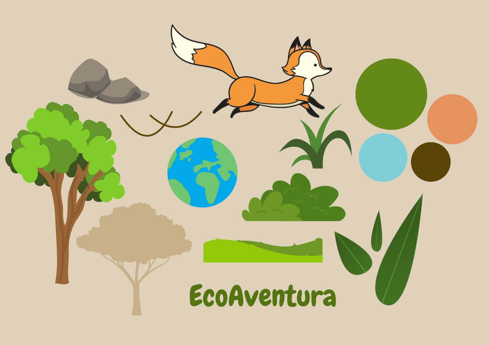
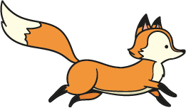
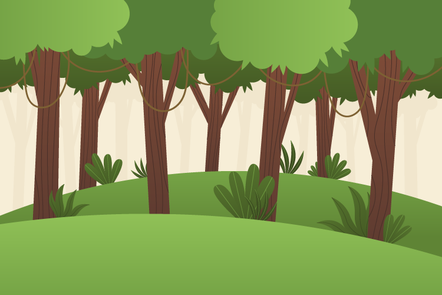
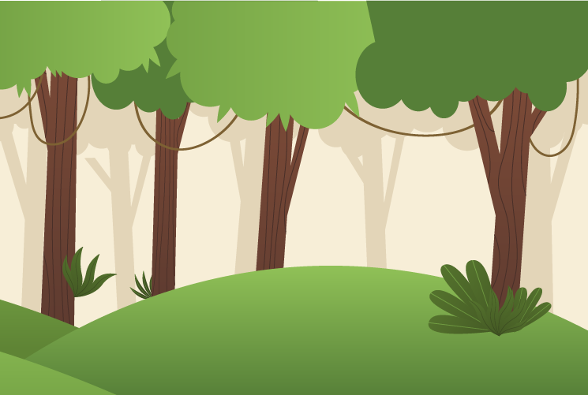
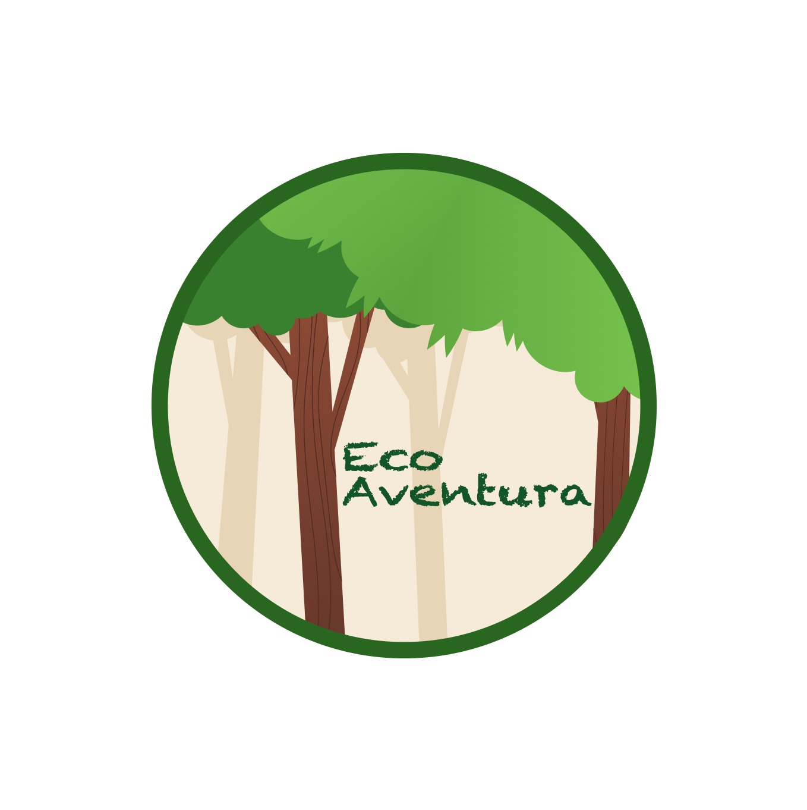

# Eco-Aventura
### Projeto desenvolvido no âmbito da Unidade Curricular de Design Multimédia, dirigida pelos docentes André Rocha e José Basto. Trabalho realizado por Daniela Metrogos (220001366) e Teresa Manso (220000801).

## Sinopse
Em "Eco-Aventura", os jogadores assumem o papel de uma ágil raposa vermelha numa jornada desesperada para escapar da destruição iminente da sua floresta natal. Confrontada com a rápida desflorestação causada pela ganância humana, a raposa deve correr sem parar para evitar ser engolida pela destruição da natureza e por isso, perderá o seu habitat natural. Com apenas um clique, os jogadores controlam os saltos da raposa enquanto ela se tenta desviar dos obstáculos. Cada clique é crucial, pois um erro pode significar o fim da corrida e a perda do habitat da raposa. Com visuais cativantes, "Eco-Aventura" desafia os jogadores a agir rapidamente em prol da preservação ambiental, enquanto enfrentam os desafios cada vez mais intensos da desflorestação descontrolada.

## Moodboard
- Moodboard

## Tópico 1: Conjunto de layouts

1. Layouts
- Personagem Principal

- Obstáculos

- Background
 

## Tópico 2: Design de Comunicação	

1. Identidade gráfica:
- Logotipo

## Tópico 3: Vídeo - Trailer

[videopromocional]([https://youtu.be/g95YfS06CsY](https://youtu.be/dfLRAo9nxYc))
